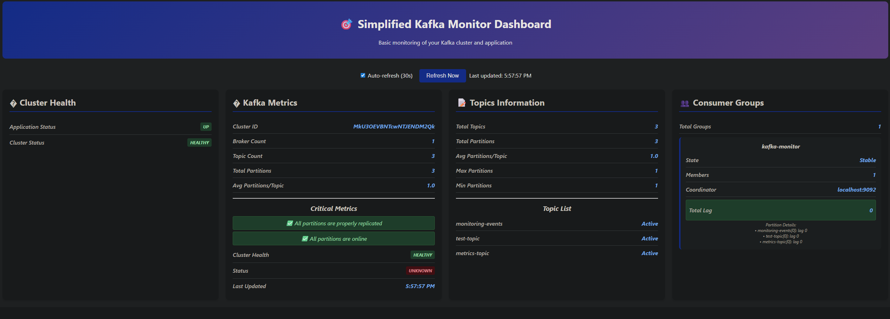

# Kafka Monitor

A Spring Boot application for monitoring Apache Kafka clusters with a web dashboard and REST API.



## Features

- Real-time Kafka cluster monitoring
- Web dashboard with auto-refresh
- REST API with OpenAPI documentation
- Topic and consumer group metrics
- Health status monitoring

## Quick Start

### Prerequisites
- Java 21+
- Maven 3.6+  
- Docker and Docker Compose

### 1. Start Kafka
```bash
docker-compose up -d
```

### 2. Run Application
```bash
mvn spring-boot:run
```

### 3. Access
- **Dashboard**: http://localhost:8081
- **API Docs**: http://localhost:8081/swagger-ui.html
- **Health**: http://localhost:8081/api/metrics/health

## API Endpoints

| Endpoint | Description |
|----------|-------------|
| `GET /api/metrics/health` | Application and cluster health |
| `GET /api/metrics/kafka` | Complete cluster metrics |
| `GET /api/metrics/topics` | Topic information |
| `GET /api/metrics/consumer-groups` | Consumer group details |

## Configuration

Key settings in `application.yml`:

```yaml
server:
  port: 8081
spring:
  kafka:
    bootstrap-servers: localhost:9092
    consumer:
      group-id: kafka-monitor
```

## Development

### Build Commands
```bash
mvn clean compile  # Generate API classes
mvn spring-boot:run # Run application
mvn test           # Run tests
mvn package        # Build JAR
```

### Docker Services
The `docker-compose.yml` includes:
- Kafka broker (port 9092)
- Kafka UI (port 8080)
- JMX metrics (port 9101)

## Tech Stack

- **Spring Boot 3.5.5** with Java 21
- **Apache Kafka 3.9.1** 
- **OpenAPI 3.0** for API documentation
- **Thymeleaf** for web templates
- **Maven** for build management